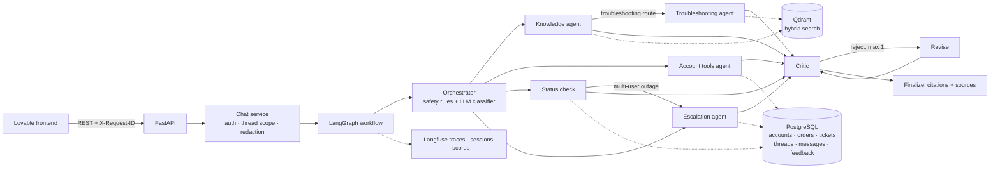

# SupportFlow — CloudBox customer-support agent

SupportFlow answers CloudBox customer questions from a versioned knowledge base, looks up private account data only through scoped tools, and escalates risky cases with a structured ticket. Every answer cites its sources, every step is traced in Langfuse, and every release is gated by a DeepEval suite.

**Stack:** FastAPI · LangGraph · LangChain (OpenAI-compatible models) · Qdrant · PostgreSQL · Langfuse · DeepEval · Lovable



| Requirement | Where |
| --- | --- |
| RAG (metadata, structure-aware chunks, filters, versions, conflicts, citations) | `app/rag/`, `docs/architecture.md` |
| LangGraph orchestrator + 5 subagents + critic | `app/graph/` |
| FastAPI endpoints, Pydantic models, structured errors, tool safety | `app/api/`, `app/tools/` |
| DeepEval suite (20 goldens + 15 new cases), JSON report, CI gate | `evals/`, `artifacts/`, `.github/workflows/ci.yml` |
| Langfuse traces, sessions, scores, alerts | `app/observability/`, `docs/langfuse_debugging.md` |
| Lovable frontend | `frontend/LOVABLE_PROMPT.md`, `frontend/README.md` |
| Tests, docs, demo | `tests/`, `docs/`, `docs/demo_script.md` |

---

## 1. Setup

### Prerequisites
- Python 3.11 or 3.12
- Docker Desktop (for PostgreSQL and Qdrant)
- A Gemini API key (Google AI Studio) or an OpenAI API key. Set `LLM_PROVIDER` and `EMBEDDING_PROVIDER` to `gemini` or `openai`. Check your key with `python scripts/check_setup.py`.
- A free Langfuse Cloud project (https://cloud.langfuse.com), for its public and secret keys

### Windows (PowerShell)
```powershell
cd supportflow
py -3.12 -m venv .venv
.\.venv\Scripts\Activate.ps1          # if blocked: Set-ExecutionPolicy -Scope CurrentUser RemoteSigned
pip install -r requirements.txt
copy .env.example .env                 # then fill in MODEL_API_KEY, LANGFUSE_* and EVALS_ADMIN_TOKEN
docker compose up -d postgres qdrant   # databases only
alembic upgrade head                   # create tables (the app also creates missing tables on startup)
python -m app.rag.ingest --reset       # index rag_materials/ into Qdrant
uvicorn app.main:app --reload --port 8000
```
Then open http://localhost:8000/docs.

### macOS / Linux
The steps are the same. Use `python3 -m venv .venv && source .venv/bin/activate` and `cp .env.example .env`.

### Everything in Docker
```bash
cp .env.example .env    # fill in keys
docker compose up --build
```

### No keys at all (offline mode)
You can run everything without any keys. This mode uses deterministic embeddings and templated, extractive answers, so tests and CI work with no network:
```powershell
$env:LLM_PROVIDER="offline"; $env:EMBEDDING_PROVIDER="offline"; $env:QDRANT_URL=":memory:"; $env:DATABASE_URL="sqlite:///./local.db"
uvicorn app.main:app --reload
```
Offline mode is for tests. The demo and the final evaluation use `LLM_PROVIDER=openai`.

> **Switching embedding providers:** vector sizes differ between providers. Run `python -m app.rag.ingest --reset` after changing `EMBEDDING_PROVIDER` or `EMBEDDING_MODEL`.

## 2. What happens on startup
1. Tables are created if missing (Alembic is the source of truth for schema changes).
2. Fixture data is seeded idempotently: `data/accounts.json`, `orders.json`, and `support_tickets.json`, plus four demo users.
3. If the Qdrant collection is empty, `rag_materials/` is ingested. If it already has data, nothing is re-indexed, so the vectors survive restarts.

**Demo users** (the user switcher in the frontend). In production the identity would come from an auth token. Here `user_id` maps server-side to an account, and the chat text can never change it.

| user_id | account | plan | verified |
| --- | --- | --- | --- |
| user_maya | acc_1001 | Standard | yes |
| user_omar | acc_1002 | Team | **no** (private lookups are denied) |
| user_nour | acc_1003 | Business | yes |
| user_guest | none | none | none |

## 3. Using the API
```bash
curl -X POST localhost:8000/chat -H "Content-Type: application/json" \
  -d '{"user_id":"user_maya","message":"What is the difference between the Standard and Team plans?"}'
```
The full contract is in `docs/api_contract.md`. These endpoints go beyond the brief's minimum and are useful for the demo:

- `GET /threads?user_id=`, which powers the thread list.
- `GET /users`, which powers the user switcher.
- `GET /metrics/summary`, which powers the monitoring page and alerts.
- `POST /dev/status-scenario?scenario=previews_degraded` (admin token), which simulates a live incident.
- The `X-Fault-Inject: get_order:timeout` header, which simulates a tool timeout (development only).

`python scripts/demo_flow.py` runs the whole demo sequence against a running API and prints the route, tools, sources and trajectory for each step.

## 4. Tests
```powershell
pytest -q            # 60+ tests: the 12 brief scenarios, RAG, tools, safety, online-path stubs, eval gates
```
Tests run fully offline: in-memory Qdrant, temporary SQLite, no keys.

## 5. Evaluation (DeepEval)
```powershell
python -m evals.runner                       # real graph + DeepEval judge (needs OPENAI_API_KEY or MODEL_API_KEY)
python -m evals.runner --no-deepeval         # deterministic gates only
python -m evals.runner --with-known-failures # adds one deliberate failing example for the demo
deepeval test run evals/test_supportflow_goldens.py
```
The runner produces `artifacts/eval_results.json` (the full per-case record) and `artifacts/eval_report.md` (summary, gates, and failure analysis). Scores are also sent to Langfuse. Gates are defined in `evals/thresholds.json`. The run exits non-zero when a gate fails, which is what CI uses. Evaluation can also be started from the API with `POST /evals/run` (requires the `X-Admin-Token` header).

## 6. Monitoring (Langfuse)
Set `LANGFUSE_PUBLIC_KEY`, `LANGFUSE_SECRET_KEY`, and `LANGFUSE_HOST`. Each chat turn creates one trace:
- The trace name is `supportflow.chat`.
- `session_id` is the thread ID and `user_id` is the user ID.
- Child observations are the orchestrator, retrieval, embeddings, each tool, each subagent, the critic, and every LLM generation, with tokens and cost.
- The trace carries scores: `critic_approved`, `escalated`, `no_evidence`, `user_feedback`, and `eval_*`.

See `docs/langfuse_debugging.md` for how to debug a failed answer from its trace.

## 7. Frontend (Lovable)
Paste `frontend/LOVABLE_PROMPT.md` into Lovable. A Lovable app runs in the cloud, so it cannot call `localhost`. Expose the API with a tunnel:
```powershell
ngrok http 8000                  # or: cloudflared tunnel --url http://localhost:8000
```
Then set `VITE_API_BASE_URL` in Lovable to the tunnel URL. CORS already allows `*.lovable.app` and `*.lovableproject.com`. Details are in `frontend/README.md`.

## 8. Project layout
```
app/
  api/            routes.py, schemas.py, deps.py
  graph/          orchestrator.py, router.py, state.py, llm.py, prompts.py, common.py
    subagents/    knowledge, troubleshooting, account, status, escalation, critic (+ revise/finalize)
  rag/            loader, chunker, embeddings, store (Qdrant), retriever (hybrid + conflicts), ingest
  tools/          base (timeouts/retries/fault injection), support_tools (scoped), redaction
  db/             models, session, seed
  observability/  tracing (Langfuse v4 wrapper)
  services/       chat_service (one turn: auth → graph → persistence → monitoring)
evals/            runner.py, goldens.json (original), goldens_extra.json (15 new), case_context.json, thresholds.json
tests/            12 brief scenarios + unit tests
migrations/       Alembic
rag_materials/    13 original docs + 2 added test docs (archived 3.2 catalogue, community tips)
docs/             architecture, api_contract, agent_contracts, limitations, langfuse_debugging, test_results, demo_script
frontend/         Lovable prompt, connection guide, TypeScript API types
```

## 9. Submission checklist
- [ ] Repository with README, `.env.example` (no secrets), migrations, tests, and CI
- [ ] Lovable app link, connected to the API through a tunnel
- [ ] `artifacts/eval_results.json` from a real-model DeepEval run (`python -m evals.runner`)
- [ ] Langfuse screenshots: one trace tree, a session (multi-turn thread), scores, and the cost/latency dashboard
- [ ] 7–10 minute demo video following `docs/demo_script.md`
- [ ] `docs/` (architecture, API contract, agent contracts, limitations, test results)
**Live frontend (Lovable):** https://your-link.lovable.app

Do not commit `.env`, real keys, Langfuse secrets, or local database files. `.gitignore` covers these.
