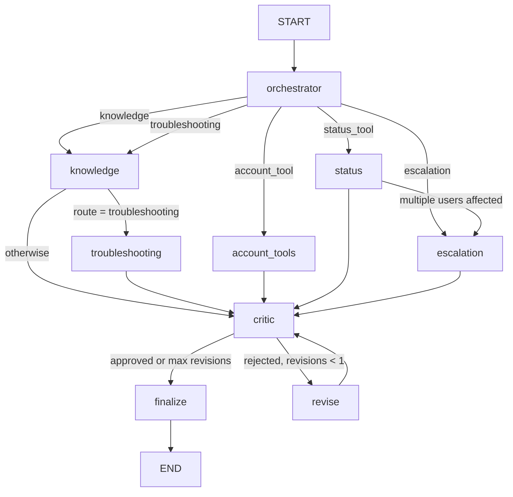

# Architecture

## 1. Request lifecycle (one chat turn)

1. **FastAPI** (`POST /chat`) assigns or propagates `X-Request-ID` and validates the `ChatRequest`.
2. **The chat service** (`app/services/chat_service.py`) does the following, in order:
   - It resolves the caller's identity server-side (`user_id` → account, workspace, verification state). Nothing in the message text can change this identity.
   - It checks thread ownership: a `thread_id` owned by another user returns **403**.
   - It detects and **redacts secrets** (Luhn-checked card numbers, CVV, one-time codes, passwords). This happens *before* anything reaches the model, the trace, or the database.
   - It loads recent turns of *this* thread through the scoped `get_thread_summary` tool.
   - It opens a Langfuse root trace (`session_id = thread_id`) and invokes the LangGraph workflow with `recursion_limit = 25`.
   - It persists the redacted user message and the assistant message (citations, tool events, trajectory, ticket, trace ID). It writes a `request_logs` row for monitoring and attaches trace scores.
3. **The response** returns `thread_id`, `answer`, `citations`, `tool_events`, and `needs_escalation`. It also carries `route`, `trajectory`, `ticket_id`, `no_evidence`, `request_id`, `trace_id`, and `latency_ms`.

## 2. LangGraph workflow

The workflow is bounded in several ways. There is at most one revision loop. There is a hard budget of `MAX_MODEL_CALLS=6` model calls per request. The graph recursion limit is 25. Each tool has a timeout (`TOOL_TIMEOUT_S`) and one retry, and at most 3 lookups run per account turn. Search results are capped at 8 chunks.

### Shared state (`app/graph/state.py`)
| Field | Meaning |
| --- | --- |
| `request`, `history`, `auth` | Redacted message, recent turns of this thread only, and the server-resolved identity |
| `route`, `route_reason`, `route_source`, `escalation_category`, `flags`, `entities` | Routing decision and its provenance (`rules`, `llm`, or `rules_fallback`) |
| `standalone_query`, `focus_query` | Query rewritten for retrieval, with follow-ups resolved |
| `retrieved_context`, `evidence`, `conflicts` | Retrieval output and version/trust conflicts |
| `tool_events`, `subagent_results`, `trajectory` | Append-only lists (additive reducers) |
| `draft_answer`, `used_doc_ids`, `critic`, `revisions`, `final_answer`, `citations` | Answer pipeline |
| `escalation` | `needs_escalation`, category, ticket ID, and priority |

### Routing: safety-first hybrid (`app/graph/router.py`)
Hard rules run first, and **the model cannot override them**. A prompt-injected or confused model therefore cannot downgrade an account-takeover report to a FAQ answer. The precedence order is:

1. security (takeover, exposed credentials)
2. password requests
3. privacy (data export or deletion)
4. legal
5. data loss
6. billing disputes and refunds
7. live status and outages
8. multiple users affected or a critical block
9. private lookups (`ord_`, `inv_`, `SUP-` IDs, "my invoice/plan")
10. an issue that persists after troubleshooting
11. troubleshooting symptoms

Soft cases (knowledge vs troubleshooting, and vague escalation) go to the LLM classifier, which also rewrites follow-ups into standalone queries. If the model fails, the keyword fallback takes over.

## 3. RAG design (`app/rag/`)

| Concern | Implementation |
| --- | --- |
| Metadata | `loader.py` parses the `---` block. All six fields (doc_id, title, product, version, source_type, trust_level) are required, and invalid documents are rejected with 422. |
| Chunking | `chunker.py` is structure-aware. Each paragraph is a unit, because the corpus writes one rule plus its conditions per paragraph. A lead-in ending in ":" is merged with the list that follows (for example, "check these steps in order:" plus steps 1–6). Tables and lists are never split. Each FAQ question/answer pair stays one chunk. Tiny neighbouring paragraphs are merged. The title and section are embedded with every chunk. |
| Vector store | Qdrant with cosine distance. Every metadata field is stored as payload with a keyword index. Point IDs are `uuid5(doc_id, chunk_index)`, so re-ingesting a doc replaces its old chunks. |
| Hybrid search | Dense similarity plus BM25 over the same chunks (`score = cosine + 0.15 × normalised BM25`). Rare exact terms such as product names ("Dropbox"), versions ("3.4.2"), and IDs are therefore not lost. |
| Filters | product, version, source_type, trust_level, and doc_id. **Default trust = official + internal.** Community material is only used when explicitly requested. |
| Relevance floor | `MIN_RELEVANCE_SCORE` (0.30 for OpenAI embeddings). Below it the result is "no evidence", and the agent says so and asks one focused question. |
| Diversity | At most 2 chunks per document in the top-k. |
| Versions | `versioning.py` compares semantic versions ("3.4" > "3.2") and date versions ("2026-02" > "2026-01"), and never compares across the two formats. |
| Conflicts | Two documents with the same product and source_type but different versions or trust are flagged. The answer follows the newer or more trusted source and says that an older source differs. The corpus has no real conflict, so `rag_materials/product_catalog_v3_2.md` (an archived 3.2 edition) was added to exercise this path. |
| Policy-pinned retrieval | Tool and escalation routes also retrieve from the documents that govern them (for example, billing → `billing_refunds` + `escalation_policy`). Every answer is therefore grounded in, and cites, its policy. |
| Citations | Only doc_ids that the answering agent actually used, *and* that exist in the evidence, become citations. Hallucinated IDs are dropped. The answer ends with a readable "Sources:" line. |

## 4. Data model (`app/db/models.py`)

Long-term customer data is kept separate from conversation memory.

- **Customer data:** `users`, `accounts`, `orders`, and `tickets`.
- **Thread memory:** `threads`, `messages`, and `feedback`.
- **Operational:** `documents` (the KB registry, including source text for re-indexing), `request_logs` (monitoring), and `eval_runs`.

PostgreSQL is used in development and production. SQLite is used in tests. Alembic migrations live in `migrations/`.

## 5. Tool layer and safety (`app/tools/`)

- **Scope checks live in the tool layer**, not in prompts. For example, `get_order` checks: account linked → claimed account matches the session → record exists → record belongs to the session account → account verified.
- Every tool returns a `ToolResult` and emits a `ToolEvent` (tool, status `success|error|denied`, redacted args, summary, error_code, latency, attempts). Tools never raise into the graph.
- Timeouts, one retry, and no retry on denials. Fault injection is available for tests and the demo.
- `create_ticket` redacts every free-text field before writing.
- The critic's deterministic guardrails check for the following problems:
  - an empty answer
  - an answer without evidence
  - a knowledge answer without citations
  - a request for secrets
  - an unsupported promise (refund or time) that is not in the evidence
  - identifiers or emails outside the user's scope
  - an escalation answer missing its ticket ID

  In online mode, an LLM groundedness check is added. Rejected answers get one revision. A second rejection ships a safe fallback, never the unsafe text.

## 6. Degradation
| Failure | Behaviour |
| --- | --- |
| Model call fails, times out, or exceeds budget | The node falls back to its deterministic path (rules routing, extractive answer, or template). This is visible in the trace. |
| Tool timeout or error | A structured `ToolEvent` is emitted, and the user gets a clear "couldn't complete, nothing changed" answer. There is no crash. |
| Status tool down | The answer says current status can't be confirmed. Historical incidents are never used as a substitute. |
| Qdrant unavailable | `/health` reports `degraded`, and document ingestion returns 503. |
| Langfuse unavailable | Tracing becomes a no-op and requests are unaffected. |
| Unexpected graph error | The API returns an apology with the request ID, and `request_logs.error` is set so it shows on the monitoring page. |
